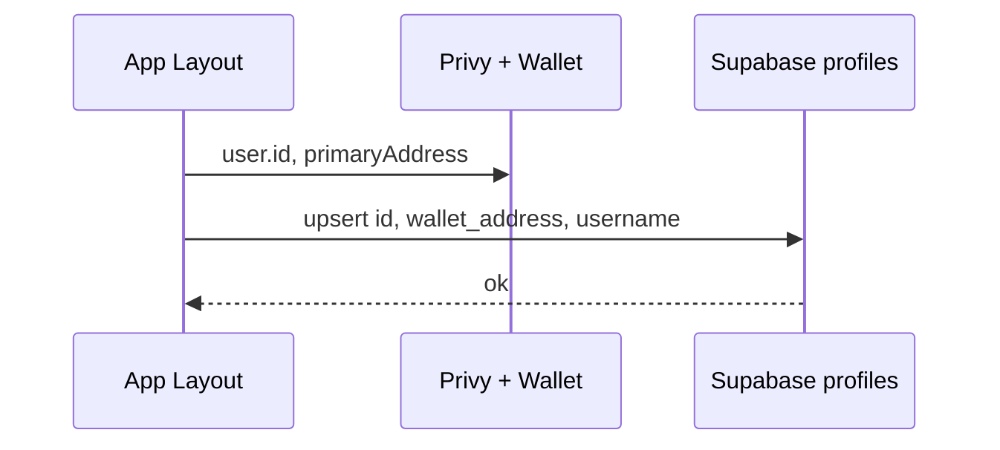

# Supabase geliştirme planı

Bu plan, daha önce önerilen Supabase ile ilgili geliştirmeleri adım adım uygulamak için hazırlanmıştır.

---

## Mevcut durum

- **Auth:** Uygulama sadece Privy kullanıyor; Supabase Auth yok. Kullanıcı `usePrivy().user` ve `useEmbeddedSolanaWallet()` ile tanımlanıyor.
- **Supabase kullanımı:** Sadece [app/(app)/portfolio/index.tsx](app/(app)/portfolio/index.tsx) (Leaderboard) `profiles` tablosundan SELECT yapıyor. Seed’deki kullanıcıların `wallet_address` değeri yok; gerçek kullanıcı Supabase’te profil olmadığı için Leaderboard’da “Your rank” hep “—” kalıyor.
- **Profil ekranı:** [app/(app)/profile/index.tsx](app/(app)/profile/index.tsx) sadece Privy `user.id` ve cüzdan bilgisini gösteriyor; Supabase’ten veri çekilmiyor.
- **Friends sekmesi:** [app/(app)/portfolio/index.tsx](app/(app)/portfolio/index.tsx) içinde `listData = tab === "Friends" ? profiles : profiles` — Friends ve All aynı liste.

---

## 1. Ortak tipler (lib)

**Amaç:** `profiles` satırı için tek bir tip tanımı; Leaderboard ve Profile ekranında aynı tipin kullanılması.

- **Yapılacak:** Yeni dosya `lib/supabase-types.ts` (veya `lib/types.ts`) oluştur.
- **İçerik:** Supabase `profiles` satırına karşılık gelen tip (örn. `Profile` veya `SupabaseProfile`): `id`, `wallet_address`, `username`, `display_name`, `avatar_url`, `bio`, `followers_count`, `following_count`, `trades_count`, `pnl`, `win_rate`, `created_at`, `updated_at` (ihtiyaca göre kısaltılabilir).
- [app/(app)/portfolio/index.tsx](app/(app)/portfolio/index.tsx) içindeki `LeaderboardProfile` interface’ini kaldırıp bu ortak tipi import etmek.

---

## 2. Giriş sonrası profil oluşturma / güncelleme (upsert)

**Amaç:** Gerçek kullanıcı giriş yapıp cüzdan bağladığında Supabase’te bir `profiles` satırı oluşsun veya güncellensin; Leaderboard’da “Your rank” ve PnL görünsün.

**Veri akışı (özet):**

- **Nerede tetiklenecek:** Auth + cüzdan bilgisi sadece (app) içinde kullanılabildiği için, upsert’i (app) ağacında bir yerde çalıştırmak gerekir. İki pratik seçenek:
  - **Seçenek A:** `app/(app)/_layout.tsx` içinde, layout’un gövdesinde render edilen küçük bir “sync” bileşeni (örn. `<ProfileSync />`). Bu bileşen `usePrivy()` ve `useEmbeddedSolanaWallet()` kullanır; `user?.id` ve `primaryAddress` ikisi de dolu olduğunda tek seferlik (veya periyodik) upsert çağrısı yapar.
  - **Seçenek B:** Mevcut bir ekranda (örn. Profile veya Leaderboard) ilk mount’ta aynı koşulla upsert. Dezavantaj: Kullanıcı önce Leaderboard’a girerse ilk açılışta hâlâ profilsiz olabilir; bir sonraki Profile ziyaretinde oluşur.
- **Öneri:** Seçenek A — [app/(app)/_layout.tsx](app/(app)/_layout.tsx) içinde `<ProfileSync />` gibi bir bileşen; `Tabs`’ın üstünde veya ilk tab’ın içinde render edilir, kendisi ekranda yer kaplamaz (null render veya sadece children).
- **Upsert mantığı:**
  - `id`: Privy `user.id` (string; örn. `did:privy:...`). Böylece aynı Privy hesabı farklı cihazda aynı profile bağlanır.
  - `wallet_address`: Mevcut Solana cüzdan adresi (`primaryAddress`).
  - `username`: UNIQUE constraint olduğu için çakışmaması gereken bir default: örn. `user_${user.id.slice(-12)}` veya `wallet_${shortenAddress(primaryAddress)}`; gerekirse rastgele sonek eklenebilir. Sonradan kullanıcı Profil ekranından değiştirebilir.
  - `display_name`: Boş veya `"Anonymous"`.
  - Diğer alanlar: Şema varsayılanlarına bırakılır (opsiyonel alanlar boş).
- **Supabase çağrısı:** `supabase.from('profiles').upsert({ id, wallet_address, username, display_name }, { onConflict: 'id' })`. `pnl` / `win_rate` gibi alanlar ilk oluşturmada varsayılan kalır; güncellemede sadece `wallet_address` (ve istenirse `updated_at`) güncellenebilir.

Bu adım tamamlandığında Leaderboard’daki “Your rank” ve PnL, giriş yapmış ve cüzdanı olan kullanıcı için dolu görünür (seed’de PnL/win_rate varsayılan 0 ise 0 gösterilir).

---

## 3. Profil ekranında Supabase verisi

**Amaç:** Profil ekranında sadece Privy/cüzdan değil, Supabase’teki profil bilgisi de gösterilsin; isteğe bağlı düzenleme yapılabilsin.

- **Veri çekme:** [app/(app)/profile/index.tsx](app/(app)/profile/index.tsx) içinde `primaryAddress` veya Privy `user.id` ile `profiles` satırını bul. Örn. `supabase.from('profiles').select('*').eq('wallet_address', primaryAddress).single()` (veya `eq('id', user.id)` — upsert’te `id = user.id` kullandıysak). Tek satır beklenir; yoksa “Profil bulunamadı” veya upsert’in henüz çalışmamış olması ihtimali düşünülür.
- **Gösterilecek alanlar:** `display_name`, `username`, `bio`, `avatar_url`, `pnl`, `win_rate`, `followers_count`, `following_count`, `trades_count` (ihtiyaca göre). Mevcut wallet bölümü aynen kalabilir.
- **Düzenleme (opsiyonel ama önerilen):** Sadece kendi profilinde görünen “Düzenle” butonu; açılan basit bir form veya inline alanlarla `display_name`, `username`, `bio` (ve istenirse `avatar_url`) düzenlenir. Kaydetmede `supabase.from('profiles').update({ display_name, username, bio }).eq('id', myProfileId)`. Username değişince UNIQUE constraint nedeniyle çakışma kontrolü (örn. insert denemesi veya özel RPC) isteğe bağlı eklenebilir.

Ortak tip bu ekranda da kullanılır; böylece Leaderboard ile tutarlı alan isimleri olur.

---

## 4. Leaderboard “Friends” sekmesi

**Amaç:** “Friends” seçildiğinde sadece takip edilen kullanıcıların listelenmesi.

- **Veri:** [supabase-schema.sql](supabase-schema.sql) içinde `follows` tablosu var: `follower_id`, `following_id` (ikisi de `profiles.id`).
- **Mantık:**  
  1. Mevcut kullanıcının `profiles.id`’si (Leaderboard’da zaten `myProfile` ile bulunuyor; upsert sonrası bu dolu olacak).
  2. `tab === "Friends"` iken: `supabase.from('follows').select('following_id').eq('follower_id', myProfile.id)` ile takip edilen id’ler alınır.
  3. Tüm `profiles` listesi (zaten PnL’e göre sıralı çekilmiş) filtrelenir: `id` değeri `following_id` listesinde olanlar gösterilir.
- **Yer:** [app/(app)/portfolio/index.tsx](app/(app)/portfolio/index.tsx) içinde:  
  - `myProfile` zaten var.  
  - Friends için ek state: örn. `followingIds: string[]`; `tab === 'Friends'` iken (ve `myProfile` varsa) `follows` sorgusu yapılıp `followingIds` doldurulur.  
  - `listData`: `tab === 'All'` ise tüm `profiles`, `tab === 'Friends'` ise `profiles.filter(p => followingIds.includes(p.id))`.
- **Edge case:** `myProfile` yoksa (henüz upsert çalışmadıysa) Friends sekmesi boş liste gösterebilir veya “Giriş yapın / profil oluşturun” mesajı verilebilir.

Bu adım, şemadaki `follows` tablosunun uygulamada kullanılmasını sağlar.

---

## 5. RLS ve güvenlik (dokümantasyon / ileri aşama)

**Mevcut:** [supabase-schema.sql](supabase-schema.sql) içinde `profiles` için INSERT/UPDATE politikaları `USING (true)` / `WITH CHECK (true)` — anon key ile herkes her satırı ekleyip güncelleyebilir. Geliştirme için uygun, production için riskli.

- **Uygulama tarafında şu an yapılacak zorunlu bir kod değişikliği yok.**  
- **Plana not olarak:** Production’da “sadece kendi profilini güncelle” kısıtı istenecekse:  
  - Supabase Auth kullanılmıyorsa “kendi” bilgisi (Privy id veya wallet) backend’de doğrulanmalı.  
  - Seçenekler: (1) Edge Function ile profil update; client sadece Edge Function’ı çağırır, Edge Function wallet/Privy token doğrulayıp `profiles` günceller. (2) RLS’te `auth.uid()` kullanmak için Supabase Auth’a JWT veya custom token ile Privy kullanıcısını bağlamak (daha karmaşık).  
  Bu madde ileride uygulanmak üzere planda “RLS sıkılaştırma / backend ile güncelleme” başlığıyla bırakılabilir.

---

## 6. Veritabanı tarafı kontrolü

- **Schema:** `supabase-schema.sql` zaten `profiles` ve `follows` için tabloları ve RLS’i tanımlıyor.  
- **Seed:** [seed-data.sql](seed-data.sql) `pnl` ve `win_rate` kolonlarını ekliyor ve örnek kullanıcıları ekliyor. Bu dosyanın Supabase SQL Editor’da (veya migration ile) en az bir kez çalıştırıldığından emin olunmalı.  
- Uygulama kodunda ek bir SQL değişikliği gerekmez; tüm geliştirmeler mevcut şema ve seed’e göre yapılır.

---

## Uygulama sırası özeti

| Sıra | Adım                   | Dosya / yer                                                                                                                                   |
| ---- | ---------------------- | --------------------------------------------------------------------------------------------------------------------------------------------- |
| 1    | Ortak `Profile` tipi   | Yeni `lib/supabase-types.ts`; Leaderboard’da `LeaderboardProfile` kaldırılıp bu tip kullanılır.                                               |
| 2    | Profil upsert          | Yeni bileşen `ProfileSync` (veya benzeri); `app/(app)/_layout.tsx` içinde render; Privy user + primaryAddress varken `profiles` upsert.       |
| 3    | Profil ekranı Supabase | `app/(app)/profile/index.tsx`: `profiles` select (wallet veya id ile); alanları göster; opsiyonel update formu (display_name, username, bio). |
| 4    | Leaderboard Friends    | `app/(app)/portfolio/index.tsx`: `follows` sorgusu, `followingIds`, `listData` filtrelemesi.                                                  |
| 5    | RLS / production       | Şimdilik sadece planda not; ileride Edge Function veya Auth entegrasyonu.                                                                     |

Bu sırayla ilerlenmesi, önce “Your rank”ın dolmasını, sonra Profil ekranının zenginleşmesini ve en son Friends filtresinin çalışmasını sağlar.